# Frontend Implementation Guide - Thư Viện Online

## 📋 Tổng quan

Tài liệu này mô tả chi tiết cách hoạt động của Frontend trong dự án **Thư Viện Online** - một nền tảng serverless để chia sẻ tài liệu PDF/ePub.

### Tech Stack

- **Framework**: Next.js 13 (Pages Router)
- **Language**: JavaScript (sẽ migrate sang TypeScript)
- **Styling**: Tailwind CSS
- **State Management**: 
  - TanStack Query (Server State)
  - Zustand (Client State)
  - React Context (Auth State)
- **HTTP Client**: Axios
- **Auth**: AWS Amplify Auth (Cognito SDK)
- **PDF Viewer**: react-pdf
- **ePub Viewer**: epub.js
- **Hosting**: AWS Amplify Hosting

---

## 🏗️ Kiến trúc Frontend

### High-Level Architecture

```
┌─────────────────────────────────────────────────────────┐
│                    User Browser                          │
└─────────────────────────────────────────────────────────┘
                          │
                          ↓
┌─────────────────────────────────────────────────────────┐
│              Route 53 (DNS Resolution)                   │
└─────────────────────────────────────────────────────────┘
                          │
                          ↓
┌─────────────────────────────────────────────────────────┐
│         AWS Amplify Hosting (Next.js App)                │
│  ┌───────────────────────────────────────────────────┐  │
│  │  Pages Router (SSR/SSG)                           │  │
│  │  - / (Home)                                       │  │
│  │  - /books (Browse)                                │  │
│  │  - /upload (Upload)                               │  │
│  │  - /my-uploads (My Books)                         │  │
│  │  - /login, /signup (Auth)                         │  │
│  └───────────────────────────────────────────────────┘  │
└─────────────────────────────────────────────────────────┘
           │                    │                │
           ↓                    ↓                ↓
    ┌──────────┐        ┌──────────┐     ┌──────────┐
    │ Cognito  │        │   API    │     │CloudFront│
    │  (Auth)  │        │ Gateway  │     │  (CDN)   │
    └──────────┘        └──────────┘     └──────────┘
```


## 📁 Cấu trúc thư mục

```
plutonium-main/plutonium-main/
├── pages/                      # Next.js Pages Router
│   ├── _app.js                # App wrapper (ThemeProvider)
│   ├── index.js               # Home page
│   ├── books.js               # Browse books page
│   ├── upload.js              # Upload page
│   ├── my-uploads.js          # User's uploads page
│   ├── login.js               # Login page (TODO)
│   ├── signup.js              # Signup page (TODO)
│   ├── books/
│   │   └── [bookId].js        # Book detail & reader (TODO)
│   └── admin/
│       └── pending.js         # Admin dashboard (TODO)
│
├── components/                 # React components
│   ├── layout/
│   │   ├── Header.js          # Navigation bar
│   │   └── Footer.js          # Footer
│   ├── auth/                  # Auth components (TODO)
│   ├── books/                 # Book-related components (TODO)
│   └── common/                # Shared components (TODO)
│
├── lib/                       # Utilities & configs (TODO)
│   ├── api.js                 # API client (Axios)
│   ├── auth.js                # Auth utilities (Cognito)
│   └── constants.js           # Constants
│
├── hooks/                     # Custom React hooks (TODO)
│   ├── useAuth.js             # Auth hook
│   ├── useBooks.js            # Books data hook
│   └── useUpload.js           # Upload hook
│
├── store/                     # State management (TODO)
│   ├── authStore.js           # Auth state (Context)
│   └── uiStore.js             # UI state (Zustand)
│
├── styles/
│   └── global.css             # Global styles + Tailwind
│
├── public/                    # Static assets
│   ├── images/
│   └── favicon.ico
│
└── package.json               # Dependencies
```


## 🔄 State Management Strategy

### 1. TanStack Query - Server State

**Quản lý**: Tất cả data từ backend API

**Ưu điểm**:
- Auto caching (không gọi API thừa)
- Auto refetch (data luôn fresh)
- Loading/error states tự động
- Optimistic updates
- Query invalidation

**Query Keys**:
```javascript
// Search books
['books', { title: 'aws' }]
['books', { author: 'john' }]

// Admin pending list
['admin', 'pending', { page: 1 }]

// User uploads
['books', 'my-uploads', { page: 1 }]

// Read URL
['books', bookId, 'read-url']
```

**Example Usage**:
```javascript
import { useQuery, useMutation, useQueryClient } from '@tanstack/react-query';

// Fetch books
const { data, isLoading, error } = useQuery({
  queryKey: ['books', { title: searchQuery }],
  queryFn: () => api.searchBooks({ title: searchQuery }),
  enabled: !!searchQuery, // Only run when searchQuery exists
});

// Upload mutation
const queryClient = useQueryClient();
const uploadMutation = useMutation({
  mutationFn: (data) => api.uploadBook(data),
  onSuccess: () => {
    // Invalidate and refetch
    queryClient.invalidateQueries(['books', 'my-uploads']);
  },
});
```

### 2. Zustand - Client/UI State

**Quản lý**: UI state only (không phải server data)

**Data**:
- Theme (light/dark)
- Modal state (open/close, type, data)
- Sidebar (open/close)
- Toast notifications
- Filter text (trước khi submit)

**Example Store**:
```javascript
// store/uiStore.js
import create from 'zustand';

export const useUIStore = create((set) => ({
  // Modal
  modal: { isOpen: false, type: null, data: null },
  openModal: (type, data) => set({ modal: { isOpen: true, type, data } }),
  closeModal: () => set({ modal: { isOpen: false, type: null, data: null } }),

  // Toast
  toasts: [],
  addToast: (toast) => set((state) => ({ 
    toasts: [...state.toasts, { id: Date.now(), ...toast }] 
  })),
  removeToast: (id) => set((state) => ({ 
    toasts: state.toasts.filter(t => t.id !== id) 
  })),

  // Theme
  theme: 'light',
  toggleTheme: () => set((state) => ({ 
    theme: state.theme === 'light' ? 'dark' : 'light' 
  })),
}));
```

### 3. React Context - Auth State

**Quản lý**: Authentication only

**Data**:
- User info (từ JWT)
- isAuthenticated flag
- isAdmin flag
- signIn/signOut methods

**Example Context**:
```javascript
// store/authStore.js
import { createContext, useContext, useState, useEffect } from 'react';
import { Auth } from 'aws-amplify';

const AuthContext = createContext();

export function AuthProvider({ children }) {
  const [user, setUser] = useState(null);
  const [loading, setLoading] = useState(true);

  useEffect(() => {
    checkUser();
  }, []);

  async function checkUser() {
    try {
      const user = await Auth.currentAuthenticatedUser();
      setUser(user);
    } catch {
      setUser(null);
    } finally {
      setLoading(false);
    }
  }

  const value = {
    user,
    isAuthenticated: !!user,
    isAdmin: user?.signInUserSession?.accessToken?.payload['cognito:groups']?.includes('Admins'),
    signIn: async (email, password) => {
      const user = await Auth.signIn(email, password);
      setUser(user);
    },
    signOut: async () => {
      await Auth.signOut();
      setUser(null);
    },
  };

  return <AuthContext.Provider value={value}>{children}</AuthContext.Provider>;
}

export const useAuth = () => useContext(AuthContext);
```


## 🔐 Authentication Flow

### Login Flow

```mermaid
sequenceDiagram
    participant U as User
    participant FE as Frontend
    participant COG as Cognito
    participant LS as LocalStorage

    U->>FE: Nhập email/password
    FE->>COG: Auth.signIn(email, password)
    COG-->>FE: JWT tokens (access, refresh, ID)
    FE->>LS: Lưu tokens
    FE->>FE: Update AuthContext
    FE-->>U: Redirect to /books
```



### Protected Route Flow


### Implementation

```javascript
// components/ProtectedRoute.js
import { useAuth } from '@/store/authStore';
import { useRouter } from 'next/router';
import { useEffect } from 'react';

export function ProtectedRoute({ children, requireAdmin = false }) {
  const { isAuthenticated, isAdmin, loading } = useAuth();
  const router = useRouter();

  useEffect(() => {
    if (!loading) {
      if (!isAuthenticated) {
        router.push('/login');
      } else if (requireAdmin && !isAdmin) {
        router.push('/');
      }
    }
  }, [isAuthenticated, isAdmin, loading, requireAdmin, router]);

  if (loading) {
    return <div>Loading...</div>;
  }

  if (!isAuthenticated || (requireAdmin && !isAdmin)) {
    return null;
  }

  return children;
}

// Usage in pages
export default function UploadPage() {
  return (
    <ProtectedRoute>
      <div>Upload form...</div>
    </ProtectedRoute>
  );
}
```


## 📤 Upload Flow

### Upload Process

```mermaid
sequenceDiagram
    participant U as User
    participant FE as Frontend
    participant API as API Gateway
    participant LBD as Lambda
    participant S3 as S3
    participant DDB as DynamoDB

    U->>FE: Chọn file + điền form
    FE->>FE: Validate (size, type)
    FE->>API: POST /books/upload-url
    API->>LBD: createUploadUrl
    LBD->>DDB: Ghi metadata (status: UPLOADING)
    LBD->>S3: Tạo Presigned PUT URL
    LBD-->>API: Return URL + bookId
    API-->>FE: { uploadUrl, bookId }
    FE->>S3: PUT file (direct upload)
    S3-->>FE: Upload success
    FE-->>U: Show success message
    
    Note over S3,DDB: S3 Event triggers Lambda
    S3->>LBD: validateMimeType
    LBD->>S3: Đọc magic bytes
    alt Valid MIME
        LBD->>DDB: Update status: PENDING
    else Invalid MIME
        LBD->>S3: Delete file
        LBD->>DDB: Update status: REJECTED_INVALID_TYPE
    end
```



### Implementation

```javascript
// pages/upload.js
import { useState } from 'react';
import { useMutation } from '@tanstack/react-query';
import axios from 'axios';

export default function UploadPage() {
  const [file, setFile] = useState(null);
  const [formData, setFormData] = useState({ title: '', author: '', description: '' });
  const [uploadProgress, setUploadProgress] = useState(0);

  // Step 1: Get presigned URL
  const getUploadUrlMutation = useMutation({
    mutationFn: async (data) => {
      const response = await axios.post('/api/books/upload-url', data, {
        headers: { Authorization: `Bearer ${getAccessToken()}` }
      });
      return response.data;
    },
  });

  // Step 2: Upload to S3
  const uploadToS3 = async (uploadUrl, file) => {
    await axios.put(uploadUrl, file, {
      headers: { 'Content-Type': file.type },
      onUploadProgress: (progressEvent) => {
        const progress = Math.round((progressEvent.loaded * 100) / progressEvent.total);
        setUploadProgress(progress);
      },
    });
  };

  const handleSubmit = async (e) => {
    e.preventDefault();

    // Validate
    if (!file || !formData.title || !formData.author) {
      alert('Vui lòng điền đầy đủ thông tin!');
      return;
    }

    if (file.size > 50 * 1024 * 1024) {
      alert('File quá lớn! Tối đa 50MB');
      return;
    }

    try {
      // Step 1: Get presigned URL
      const { uploadUrl, bookId } = await getUploadUrlMutation.mutateAsync({
        fileName: file.name,
        fileSize: file.size,
        ...formData,
      });

      // Step 2: Upload file to S3
      await uploadToS3(uploadUrl, file);

      alert('Upload thành công! Sách đang chờ duyệt.');
      router.push('/my-uploads');
    } catch (error) {
      console.error('Upload error:', error);
      alert('Upload thất bại!');
    }
  };

  return (
    <form onSubmit={handleSubmit}>
      {/* Form fields... */}
    </form>
  );
}
```


## 📖 Read Flow

### Read Process

```mermaid
sequenceDiagram
    participant U as User
    participant FE as Frontend
    participant API as API Gateway
    participant LBD as Lambda
    participant DDB as DynamoDB
    participant CF as CloudFront
    participant S3 as S3

    U->>FE: Click "Đọc sách"
    FE->>API: GET /books/{bookId}/read-url
    API->>LBD: getReadUrl
    LBD->>DDB: Check status = APPROVED
    alt Not approved
        LBD-->>API: 403 Forbidden
        API-->>FE: Error
        FE-->>U: "Sách chưa được duyệt"
    else Approved
        LBD->>CF: Tạo Signed URL (TTL 1h)
        LBD-->>API: { readUrl, expiresIn }
        API-->>FE: Signed URL
        FE->>FE: Load PDF/ePub viewer
        FE->>CF: GET file (Signed URL)
        CF->>S3: Fetch file (OAC)
        S3-->>CF: File content
        CF-->>FE: File content
        FE-->>U: Display book
    end
```



### Implementation

```javascript
// pages/books/[bookId].js
import { useRouter } from 'next/router';
import { useQuery } from '@tanstack/react-query';
import { Document, Page } from 'react-pdf';
import { useState } from 'react';

export default function BookReaderPage() {
  const router = useRouter();
  const { bookId } = router.query;
  const [numPages, setNumPages] = useState(null);
  const [pageNumber, setPageNumber] = useState(1);

  // Fetch read URL
  const { data, isLoading, error } = useQuery({
    queryKey: ['books', bookId, 'read-url'],
    queryFn: async () => {
      const response = await axios.get(`/api/books/${bookId}/read-url`, {
        headers: { Authorization: `Bearer ${getAccessToken()}` }
      });
      return response.data;
    },
    enabled: !!bookId,
    staleTime: 50 * 60 * 1000, // 50 minutes (URL expires in 1 hour)
  });

  if (isLoading) return <div>Loading...</div>;
  if (error) return <div>Error: {error.message}</div>;

  return (
    <div className="pdf-viewer">
      <Document
        file={data.readUrl}
        onLoadSuccess={({ numPages }) => setNumPages(numPages)}
      >
        <Page pageNumber={pageNumber} />
      </Document>

      <div className="controls">
        <button 
          disabled={pageNumber <= 1}
          onClick={() => setPageNumber(pageNumber - 1)}
        >
          Previous
        </button>
        <span>Page {pageNumber} of {numPages}</span>
        <button 
          disabled={pageNumber >= numPages}
          onClick={() => setPageNumber(pageNumber + 1)}
        >
          Next
        </button>
      </div>
    </div>
  );
}
```


## 🔍 Search Flow

### Search Constraints

**Quan trọng**: Backend chỉ hỗ trợ search **1 field tại 1 thời điểm** (title HOẶC author) do DynamoDB GSI constraints.

### Search Process

```mermaid
sequenceDiagram
    participant U as User
    participant FE as Frontend
    participant API as API Gateway
    participant LBD as Lambda
    participant DDB as DynamoDB (GSI)

    U->>FE: Chọn mode (Title/Author)
    U->>FE: Nhập query
    FE->>FE: Validate (chỉ 1 field)
    FE->>API: GET /books/search?title=aws
    API->>LBD: searchBooks
    LBD->>DDB: Query GSI1 (title)
    DDB-->>LBD: Results (status=APPROVED only)
    LBD-->>API: { data: [...], meta: {...} }
    API-->>FE: Search results
    FE-->>U: Display books
```



### Implementation

```javascript
// pages/books.js
import { useState } from 'react';
import { useQuery } from '@tanstack/react-query';

export default function BooksPage() {
  const [searchMode, setSearchMode] = useState('title'); // 'title' or 'author'
  const [searchQuery, setSearchQuery] = useState('');
  const [submittedQuery, setSubmittedQuery] = useState('');

  // Search query
  const { data, isLoading } = useQuery({
    queryKey: ['books', { [searchMode]: submittedQuery }],
    queryFn: async () => {
      const params = new URLSearchParams({
        [searchMode]: submittedQuery,
        page: 1,
        pageSize: 20,
      });
      const response = await axios.get(`/api/books/search?${params}`);
      return response.data;
    },
    enabled: !!submittedQuery,
  });

  const handleSearch = (e) => {
    e.preventDefault();
    
    // Validation: Ensure only one field
    if (!searchQuery.trim()) {
      alert('Vui lòng nhập từ khóa tìm kiếm!');
      return;
    }

    setSubmittedQuery(searchQuery.trim());
  };

  return (
    <div>
      <form onSubmit={handleSearch}>
        {/* Mode Selector */}
        <select 
          value={searchMode} 
          onChange={(e) => {
            setSearchMode(e.target.value);
            setSearchQuery(''); // Clear query when switching mode
          }}
        >
          <option value="title">Tìm theo tên sách</option>
          <option value="author">Tìm theo tác giả</option>
        </select>

        {/* Search Input */}
        <input
          type="text"
          value={searchQuery}
          onChange={(e) => setSearchQuery(e.target.value)}
          placeholder={
            searchMode === 'title' 
              ? 'Nhập tên sách...' 
              : 'Nhập tên tác giả...'
          }
        />

        <button type="submit">Tìm kiếm</button>
      </form>

      {/* Results */}
      {isLoading && <div>Đang tìm kiếm...</div>}
      {data && (
        <div>
          <p>Tìm thấy {data.meta.total} kết quả</p>
          <div className="grid">
            {data.data.map(book => (
              <BookCard key={book.bookId} book={book} />
            ))}
          </div>
        </div>
      )}
    </div>
  );
}
```


## 👤 My Uploads Flow

### Process


### Status Badges

| Status | Màu | Ý nghĩa | Actions |
|--------|-----|---------|---------|
| `UPLOADING` | Gray | File đang xử lý (chưa qua validateMimeType) | Chờ |
| `PENDING` | Yellow | Chờ admin duyệt | Chờ |
| `APPROVED` | Green | Đã duyệt, có thể đọc | "Đọc sách" button |
| `REJECTED` | Red | Bị từ chối (có lý do) | Xem lý do |
| `REJECTED_INVALID_TYPE` | Red | File không hợp lệ | Xem thông báo |

### Implementation

```javascript
// pages/my-uploads.js
import { useQuery } from '@tanstack/react-query';
import { useAuth } from '@/store/authStore';

export default function MyUploadsPage() {
  const { user } = useAuth();

  const { data, isLoading } = useQuery({
    queryKey: ['books', 'my-uploads'],
    queryFn: async () => {
      const response = await axios.get('/api/books/my-uploads', {
        headers: { Authorization: `Bearer ${getAccessToken()}` }
      });
      return response.data;
    },
    enabled: !!user,
  });

  const getStatusBadge = (status) => {
    const badges = {
      UPLOADING: {
        text: 'Đang xử lý',
        className: 'bg-gray-100 text-gray-800',
      },
      PENDING: {
        text: 'Chờ duyệt',
        className: 'bg-yellow-100 text-yellow-800',
      },
      APPROVED: {
        text: 'Đã duyệt',
        className: 'bg-green-100 text-green-800',
      },
      REJECTED: {
        text: 'Bị từ chối',
        className: 'bg-red-100 text-red-800',
      },
      REJECTED_INVALID_TYPE: {
        text: 'File không hợp lệ',
        className: 'bg-red-100 text-red-800',
      },
    };
    return badges[status] || badges.PENDING;
  };

  return (
    <div>
      {data?.data.map(book => (
        <div key={book.bookId} className="book-card">
          <h3>{book.title}</h3>
          <span className={getStatusBadge(book.status).className}>
            {getStatusBadge(book.status).text}
          </span>
          
          {/* Show rejection reason */}
          {book.status === 'REJECTED' && book.rejectedReason && (
            <p className="text-red-600">
              Lý do: {book.rejectedReason}
            </p>
          )}

          {/* Show action button */}
          {book.status === 'APPROVED' && (
            <Link href={`/books/${book.bookId}`}>
              Đọc sách
            </Link>
          )}
        </div>
      ))}
    </div>
  );
}
```


## 👨‍💼 Admin Flow

### Admin Approval Process

```mermaid
sequenceDiagram
    participant A as Admin
    participant FE as Frontend
    participant API as API Gateway
    participant LBD as Lambda
    participant S3 as S3
    participant DDB as DynamoDB

    A->>FE: Access /admin/pending
    FE->>API: GET /admin/books/pending
    API->>LBD: listPendingBooks
    LBD->>LBD: Check cognito:groups = Admins
    LBD->>DDB: Query GSI5 (status=PENDING)
    DDB-->>LBD: Pending books
    LBD-->>API: { data: [...], meta: {...} }
    API-->>FE: Pending list
    FE-->>A: Display with Approve/Reject buttons

    alt Approve
        A->>FE: Click "Approve"
        FE->>API: POST /admin/books/{id}/approve
        API->>LBD: approveBook
        LBD->>S3: Copy uploads/ → public/books/
        LBD->>DDB: Update status=APPROVED
        LBD->>S3: Delete from uploads/
        LBD-->>API: Success
        API-->>FE: Success
        FE->>FE: Invalidate pending query
        FE-->>A: Refresh list
    else Reject
        A->>FE: Click "Reject" + nhập lý do
        FE->>API: POST /admin/books/{id}/reject
        API->>LBD: rejectBook
        LBD->>S3: Delete file
        LBD->>DDB: Update status=REJECTED + reason
        LBD-->>API: Success
        API-->>FE: Success
        FE->>FE: Invalidate pending query
        FE-->>A: Refresh list
    end
```



### Implementation

```javascript
// pages/admin/pending.js
import { useQuery, useMutation, useQueryClient } from '@tanstack/react-query';
import { useAuth } from '@/store/authStore';
import { useState } from 'react';

export default function AdminPendingPage() {
  const { isAdmin } = useAuth();
  const queryClient = useQueryClient();
  const [rejectModal, setRejectModal] = useState({ isOpen: false, bookId: null });

  // Fetch pending books
  const { data, isLoading } = useQuery({
    queryKey: ['admin', 'pending'],
    queryFn: async () => {
      const response = await axios.get('/api/admin/books/pending', {
        headers: { Authorization: `Bearer ${getAccessToken()}` }
      });
      return response.data;
    },
    enabled: isAdmin,
  });

  // Approve mutation
  const approveMutation = useMutation({
    mutationFn: async (bookId) => {
      await axios.post(`/api/admin/books/${bookId}/approve`, null, {
        headers: { Authorization: `Bearer ${getAccessToken()}` }
      });
    },
    onSuccess: () => {
      queryClient.invalidateQueries(['admin', 'pending']);
      alert('Đã duyệt sách!');
    },
  });

  // Reject mutation
  const rejectMutation = useMutation({
    mutationFn: async ({ bookId, reason }) => {
      await axios.post(`/api/admin/books/${bookId}/reject`, 
        { reason },
        { headers: { Authorization: `Bearer ${getAccessToken()}` } }
      );
    },
    onSuccess: () => {
      queryClient.invalidateQueries(['admin', 'pending']);
      setRejectModal({ isOpen: false, bookId: null });
      alert('Đã từ chối sách!');
    },
  });

  const handleReject = (reason) => {
    if (!reason || reason.length < 10) {
      alert('Vui lòng nhập lý do từ chối (tối thiểu 10 ký tự)');
      return;
    }
    rejectMutation.mutate({ 
      bookId: rejectModal.bookId, 
      reason 
    });
  };

  if (!isAdmin) {
    return <div>Bạn không có quyền truy cập trang này</div>;
  }

  return (
    <div>
      <h1>Sách chờ duyệt</h1>
      
      {data?.data.map(book => (
        <div key={book.bookId} className="pending-card">
          <h3>{book.title}</h3>
          <p>Tác giả: {book.author}</p>
          <p>Người tải: {book.uploader}</p>
          <p>Kích thước: {(book.fileSize / 1024 / 1024).toFixed(2)} MB</p>
          
          <div className="actions">
            <button 
              onClick={() => approveMutation.mutate(book.bookId)}
              disabled={approveMutation.isLoading}
              className="btn-approve"
            >
              Duyệt
            </button>
            <button 
              onClick={() => setRejectModal({ isOpen: true, bookId: book.bookId })}
              className="btn-reject"
            >
              Từ chối
            </button>
          </div>
        </div>
      ))}

      {/* Reject Modal */}
      {rejectModal.isOpen && (
        <RejectModal
          onClose={() => setRejectModal({ isOpen: false, bookId: null })}
          onSubmit={handleReject}
        />
      )}
    </div>
  );
}
```


## 🌐 API Integration

### API Client Setup

```javascript
// lib/api.js
import axios from 'axios';
import { Auth } from 'aws-amplify';

const API_BASE_URL = process.env.NEXT_PUBLIC_API_URL;

// Create axios instance
const apiClient = axios.create({
  baseURL: API_BASE_URL,
  timeout: 30000,
});

// Request interceptor - Add JWT token
apiClient.interceptors.request.use(
  async (config) => {
    try {
      const session = await Auth.currentSession();
      const token = session.getAccessToken().getJwtToken();
      config.headers.Authorization = `Bearer ${token}`;
    } catch (error) {
      console.error('Failed to get token:', error);
    }
    return config;
  },
  (error) => Promise.reject(error)
);

// Response interceptor - Handle errors
apiClient.interceptors.response.use(
  (response) => response,
  async (error) => {
    const originalRequest = error.config;

    // If 401 and not already retried, try to refresh token
    if (error.response?.status === 401 && !originalRequest._retry) {
      originalRequest._retry = true;
      
      try {
        const session = await Auth.currentSession();
        const token = session.getAccessToken().getJwtToken();
        originalRequest.headers.Authorization = `Bearer ${token}`;
        return apiClient(originalRequest);
      } catch (refreshError) {
        // Refresh failed, redirect to login
        window.location.href = '/login';
        return Promise.reject(refreshError);
      }
    }

    return Promise.reject(error);
  }
);

export default apiClient;
```

### API Methods

```javascript
// lib/api.js (continued)

export const api = {
  // Auth
  auth: {
    signUp: (email, password, name) => 
      Auth.signUp({ username: email, password, attributes: { name } }),
    signIn: (email, password) => 
      Auth.signIn(email, password),
    signOut: () => 
      Auth.signOut(),
    forgotPassword: (email) => 
      Auth.forgotPassword(email),
    resetPassword: (email, code, newPassword) => 
      Auth.forgotPasswordSubmit(email, code, newPassword),
  },

  // Books
  books: {
    search: (params) => 
      apiClient.get('/books/search', { params }),
    getReadUrl: (bookId) => 
      apiClient.get(`/books/${bookId}/read-url`),
    getMyUploads: (params) => 
      apiClient.get('/books/my-uploads', { params }),
  },

  // Upload
  upload: {
    createUploadUrl: (data) => 
      apiClient.post('/books/upload-url', data),
    uploadToS3: (url, file, onProgress) => 
      axios.put(url, file, {
        headers: { 'Content-Type': file.type },
        onUploadProgress: onProgress,
      }),
  },

  // Admin
  admin: {
    getPendingBooks: (params) => 
      apiClient.get('/admin/books/pending', { params }),
    approveBook: (bookId) => 
      apiClient.post(`/admin/books/${bookId}/approve`),
    rejectBook: (bookId, reason) => 
      apiClient.post(`/admin/books/${bookId}/reject`, { reason }),
  },
};
```

### Error Handling

```javascript
// lib/errorHandler.js

export function handleApiError(error) {
  if (error.response) {
    // Server responded with error
    const { error: message, code } = error.response.data;
    
    switch (code) {
      case 'UNAUTHORIZED':
        return 'Vui lòng đăng nhập lại';
      case 'FORBIDDEN':
        return 'Bạn không có quyền thực hiện thao tác này';
      case 'NOT_FOUND':
        return 'Không tìm thấy tài nguyên';
      case 'FILE_TOO_LARGE':
        return 'File quá lớn (tối đa 50MB)';
      case 'UNSUPPORTED_MEDIA_TYPE':
        return 'Chỉ chấp nhận file PDF hoặc ePub';
      case 'TOO_MANY_REQUESTS':
        return 'Quá nhiều yêu cầu, vui lòng thử lại sau';
      case 'INTERNAL_ERROR':
        return 'Lỗi hệ thống, vui lòng thử lại sau';
      default:
        return message || 'Đã xảy ra lỗi';
    }
  } else if (error.request) {
    // Request made but no response
    return 'Không thể kết nối đến server';
  } else {
    // Something else happened
    return error.message || 'Đã xảy ra lỗi';
  }
}

// Usage
try {
  await api.books.search({ title: 'aws' });
} catch (error) {
  const errorMessage = handleApiError(error);
  alert(errorMessage);
}
```


## 🎨 UI/UX Best Practices

### Design System

**Colors**:
- Primary: Blue (#3B82F6)
- Success: Green (#10B981)
- Warning: Yellow (#F59E0B)
- Danger: Red (#EF4444)
- Neutral: Gray (#6B7280)

**Typography**:
- Headings: Font weight 700-900
- Body: Font weight 400-500
- Small text: Font weight 400

**Spacing**:
- Sử dụng Tailwind spacing scale (4, 8, 12, 16, 24, 32, 48, 64px)

### Component Patterns

**Button States**:
```javascript
// Primary Button
<button className="px-6 py-3 font-medium text-white bg-blue-600 rounded-lg hover:bg-blue-700 disabled:bg-gray-400 disabled:cursor-not-allowed transition-colors">
  Submit
</button>

// Secondary Button
<button className="px-6 py-3 font-medium text-gray-900 bg-white border-2 border-gray-200 rounded-lg hover:border-blue-600 transition-colors">
  Cancel
</button>
```

**Loading States**:
```javascript
{isLoading ? (
  <div className="flex items-center justify-center py-12">
    <div className="w-8 h-8 border-4 border-blue-600 border-t-transparent rounded-full animate-spin"></div>
  </div>
) : (
  <Content />
)}
```

**Empty States**:
```javascript
<div className="py-16 text-center">
  <div className="text-6xl mb-4">📚</div>
  <h3 className="text-xl font-semibold text-gray-900 mb-2">
    Chưa có sách nào
  </h3>
  <p className="text-gray-600 mb-6">
    Hãy bắt đầu bằng cách tải lên sách đầu tiên
  </p>
  <Link href="/upload" className="btn-primary">
    Tải lên ngay
  </Link>
</div>
```

**Error States**:
```javascript
{error && (
  <div className="p-4 bg-red-50 border border-red-200 rounded-lg">
    <div className="flex items-center">
      <span className="text-red-600 mr-2">⚠️</span>
      <p className="text-red-800">{error.message}</p>
    </div>
  </div>
)}
```

### Responsive Design

```javascript
// Mobile-first approach
<div className="
  grid 
  grid-cols-1          // Mobile: 1 column
  md:grid-cols-2       // Tablet: 2 columns
  lg:grid-cols-3       // Desktop: 3 columns
  gap-6
">
  {items.map(item => <Card key={item.id} {...item} />)}
</div>
```

### Accessibility

```javascript
// Semantic HTML
<button 
  aria-label="Close modal"
  onClick={onClose}
>
  <X className="w-5 h-5" />
</button>

// Keyboard navigation
<div 
  role="button"
  tabIndex={0}
  onKeyDown={(e) => {
    if (e.key === 'Enter' || e.key === ' ') {
      handleClick();
    }
  }}
>
  Click me
</div>

// Focus states
<input className="
  focus:ring-2 
  focus:ring-blue-500 
  focus:border-transparent
" />
```


## 🚀 Deployment

### AWS Amplify Hosting Setup

**1. Connect Repository**:
```bash
# Amplify tự động detect Next.js và config build settings
```

**2. Build Settings** (amplify.yml):
```yaml
version: 1
frontend:
  phases:
    preBuild:
      commands:
        - npm ci
    build:
      commands:
        - npm run build
  artifacts:
    baseDirectory: .next
    files:
      - '**/*'
  cache:
    paths:
      - node_modules/**/*
```

**3. Environment Variables**:
```
NEXT_PUBLIC_API_URL=https://api.yourdomain.com
NEXT_PUBLIC_USER_POOL_ID=ap-southeast-1_xxxxx
NEXT_PUBLIC_CLIENT_ID=xxxxxxxxxxxxx
NEXT_PUBLIC_REGION=ap-southeast-1
```

**4. Custom Domain**:
- Add domain in Amplify Console
- Configure DNS (Route 53 or external)
- SSL certificate auto-provisioned

### CI/CD Flow


### Performance Optimization

**1. Image Optimization**:
```javascript
import Image from 'next/image';

<Image
  src="/book-cover.jpg"
  alt="Book cover"
  width={300}
  height={400}
  loading="lazy"
  placeholder="blur"
/>
```

**2. Code Splitting**:
```javascript
import dynamic from 'next/dynamic';

const PDFViewer = dynamic(() => import('@/components/PDFViewer'), {
  loading: () => <div>Loading viewer...</div>,
  ssr: false, // Disable SSR for heavy components
});
```

**3. Caching Strategy**:
```javascript
// TanStack Query config
const queryClient = new QueryClient({
  defaultOptions: {
    queries: {
      staleTime: 5 * 60 * 1000, // 5 minutes
      cacheTime: 10 * 60 * 1000, // 10 minutes
      refetchOnWindowFocus: false,
      retry: 1,
    },
  },
});
```


## 📝 Development Workflow

### Local Development

```bash
# 1. Clone repository
git clone <repo-url>
cd plutonium-main/plutonium-main

# 2. Install dependencies
npm install

# 3. Setup environment variables
cp .env.example .env.local
# Edit .env.local with your values

# 4. Run development server
npm run dev

# 5. Open browser
# http://localhost:3000
```

### Environment Variables

```bash
# .env.local
NEXT_PUBLIC_API_URL=http://localhost:3001
NEXT_PUBLIC_USER_POOL_ID=ap-southeast-1_xxxxx
NEXT_PUBLIC_CLIENT_ID=xxxxxxxxxxxxx
NEXT_PUBLIC_REGION=ap-southeast-1
```

### Git Workflow

```bash
# 1. Create feature branch
git checkout -b feature/book-reader

# 2. Make changes and commit
git add .
git commit -m "feat: add PDF reader component"

# 3. Push to remote
git push origin feature/book-reader

# 4. Create Pull Request on GitHub

# 5. After review, merge to main
# Amplify auto-deploys on merge
```

### Code Quality

**ESLint**:
```bash
npm run lint
```

**Format with Prettier** (if configured):
```bash
npm run format
```

### Testing Strategy

**Unit Tests** (TODO):
```bash
npm run test
```

**E2E Tests** (TODO):
```bash
npm run test:e2e
```


## 🔧 Troubleshooting

### Common Issues

**1. JWT Token Expired**:
```
Error: 401 Unauthorized
```
**Solution**: Token tự động refresh qua interceptor. Nếu vẫn lỗi, đăng xuất và đăng nhập lại.

**2. CORS Error**:
```
Access to XMLHttpRequest blocked by CORS policy
```
**Solution**: Kiểm tra API Gateway CORS config cho phép domain frontend.

**3. Upload Failed**:
```
Error: Network Error
```
**Solution**: 
- Kiểm tra file size ≤ 50MB
- Kiểm tra file type (.pdf, .epub)
- Kiểm tra Presigned URL chưa expired (15 phút)

**4. PDF Not Rendering**:
```
Error: Failed to load PDF
```
**Solution**:
- Kiểm tra Signed URL chưa expired (1 giờ)
- Kiểm tra CloudFront OAC config
- Kiểm tra file PDF không bị corrupt

**5. Search No Results**:
```
Empty results despite having books
```
**Solution**:
- Kiểm tra đang search đúng field (title hoặc author)
- Kiểm tra GSI đã được tạo trong DynamoDB
- Kiểm tra normalized search query (lowercase, no special chars)

### Debug Tools

**React Query Devtools**:
```javascript
// pages/_app.js
import { ReactQueryDevtools } from '@tanstack/react-query-devtools';

function MyApp({ Component, pageProps }) {
  return (
    <QueryClientProvider client={queryClient}>
      <Component {...pageProps} />
      <ReactQueryDevtools initialIsOpen={false} />
    </QueryClientProvider>
  );
}
```

**Console Logging**:
```javascript
// Enable debug logs
localStorage.setItem('debug', 'app:*');

// In code
console.log('[API]', 'Fetching books:', params);
```


## 📚 Next Steps & TODO

### Phase 1: Authentication (Tuần 1-2) ✅ In Progress
- [x] Setup project structure
- [x] Create layout components (Header, Footer)
- [x] Design home page
- [ ] Implement Cognito integration
- [ ] Create login/signup pages
- [ ] Implement AuthContext
- [ ] Add protected routes

### Phase 2: Upload & Approval (Tuần 2-3) ✅ In Progress
- [x] Create upload page UI
- [ ] Implement upload flow with Presigned URL
- [ ] Add progress tracking
- [ ] Create admin pending page
- [ ] Implement approve/reject actions
- [ ] Add validation & error handling

### Phase 3: Browse & Read (Tuần 3-4)
- [x] Create books browse page UI
- [x] Create my-uploads page UI
- [ ] Implement search functionality
- [ ] Create book detail page
- [ ] Integrate PDF viewer (react-pdf)
- [ ] Integrate ePub viewer (epub.js)
- [ ] Add pagination

### Phase 4: Polish & Deploy (Tuần 5-6)
- [ ] Add loading skeletons
- [ ] Improve error messages
- [ ] Add toast notifications
- [ ] Optimize performance
- [ ] Add analytics
- [ ] Setup Amplify hosting
- [ ] Configure custom domain
- [ ] Production deployment

### Future Enhancements
- [ ] Dark mode toggle
- [ ] Bookmarks/favorites
- [ ] Reading progress tracking
- [ ] Comments/reviews
- [ ] Categories/tags
- [ ] Advanced filters
- [ ] Email notifications
- [ ] Mobile app (React Native)


## 📖 References

### Documentation
- [Next.js Documentation](https://nextjs.org/docs)
- [Tailwind CSS](https://tailwindcss.com/docs)
- [TanStack Query](https://tanstack.com/query/latest)
- [Zustand](https://github.com/pmndrs/zustand)
- [AWS Amplify](https://docs.amplify.aws/)
- [React PDF](https://react-pdf.org/)
- [ePub.js](https://github.com/futurepress/epub.js/)

### Project Documents
- [Requirements Document](../docs/requirements.md)
- [Frontend Design](../docs/frontend-design.md)
- [Backend Design](../docs/backend-design.md)
- [Main README](../Readme.md)

### Team Contacts
- **Frontend Lead**: [Name]
- **Backend Lead**: [Name]
- **DevOps**: [Name]

---

## 🎯 Summary

Frontend của **Thư Viện Online** được xây dựng với:

✅ **Next.js 13** - SSR/SSG framework hiện đại
✅ **Tailwind CSS** - Utility-first styling
✅ **TanStack Query** - Server state management
✅ **AWS Amplify** - Hosting & CI/CD
✅ **Cognito** - Authentication

**Key Features**:
- 📚 Browse & search books
- ⬆️ Upload với Presigned URL
- 📖 Read PDF/ePub online
- 👤 User uploads management
- 👨‍💼 Admin approval system

**Current Status**: MVP in development (60% complete)

**Next Milestone**: Complete authentication & upload flow

---

*Last Updated: 2025-01-18*
*Version: 1.0*
