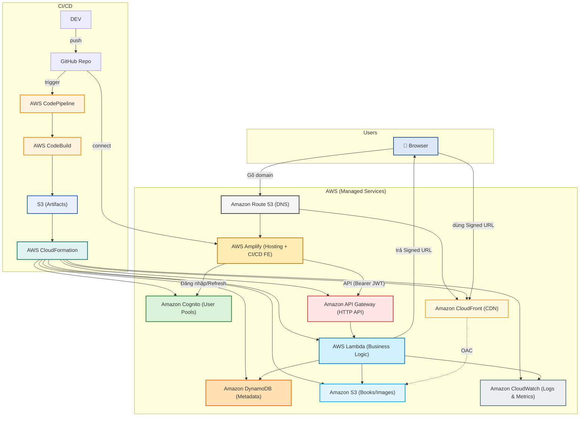
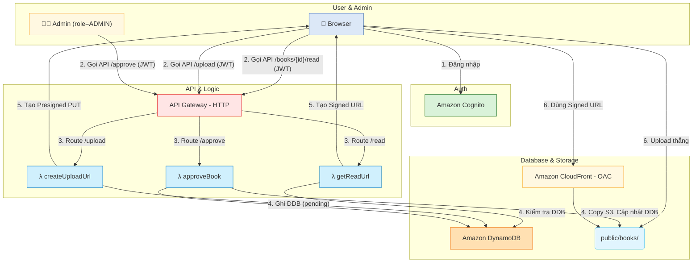
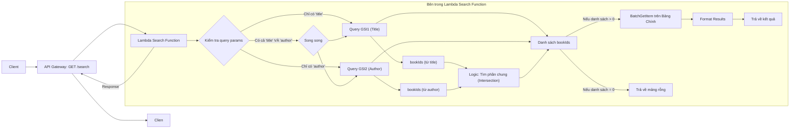

# **Thư Viện Online - Nền Tảng Nội Dung Serverless Cho Nhóm Nhỏ**

## **1. Tổng quan điều hành**

Dự án **Thư Viện Online** nhằm xây dựng một nền tảng serverless, **chi phí thấp** để lưu trữ và phân phối nội dung (PDF/ePub) cho một nhóm người dùng nhỏ (ban đầu **~100 người, n**hóm người dùng gồm sinh viên/lab cần chia sẻ tài liệu nghiên cứu nội bộ có kiểm duyệt). Giải pháp này ưu tiên tính bảo mật, quy trình duyệt nội dung (Admin Approval), và chi phí vận hành **minh bạch, tuyến tính** khi mở rộng. Kiến trúc sử dụng **AWS Serverless** hoàn toàn (Amplify, Cognito, API Gateway, Lambda, S3, CloudFront, DynamoDB). Chi phí dự kiến cho MVP (không tính Free Tier) **≈ $9.80/tháng**, đảm bảo khả năng mở rộng lên 5.000 đến 50.000 người dùng với chi phí dễ dự đoán.

## **2. Vấn đề**

### **Vấn đề là gì?**

Tài liệu và sách bị phân tán; thiếu một hệ thống **truyền tải nội dung an toàn** và có **kiểm soát truy cập**; quy trình thêm hoặc **kiểm duyệt nội dung** tốn thời gian và nhiều vấn đề liên quan đến pháp lý.

### Giải pháp

Xây dựng một pipeline serverless trên AWS: Người dùng tải lên qua **Presigned PUT URL** (tới S3 tạm); Admin phê duyệt → Lambda di chuyển file đến thư mục công khai (nhưng được bảo vệ); Người đọc truy cập qua **Signed GET URL** (từ CloudFront/CDN) để đảm bảo tốc độ và kiểm soát truy cập.

### Lợi ích và Tỷ suất hoàn vốn

- **Giá trị kinh doanh:** Tập trung hóa nội dung; kiểm soát chất lượng qua quy trình duyệt; triển khai nhanh chóng với CI/CD.
- **Lợi ích kỹ thuật:** Chi phí vận hành thấp (**≈ $9.80/tháng** ở MVP, không tính Free Tier); kiến trúc Serverless có thể **mở rộng quy mô lớn (scale) dễ dàng**; bảo mật truy cập nội dung.

---

## **3. Kiến trúc giải pháp**

### **A. High-level**

### **B. Luồng xử lý yêu cầu**

### **Dịch vụ AWS Sử Dụng**

| Dịch vụ | Vai trò chính | Hoạt động cụ thể |
| --- | --- | --- |
| **Amplify Hosting** | CI/CD + FE Hosting | Build & Deploy Next.js, quản lý domain |
| **Cognito** | Authentication | Đăng ký/Đăng nhập, cấp JWT, refresh token |
| **API Gateway** | Entry point API | Nhận request, xác thực JWT, route đến Lambda |
| **Lambda** | Business Logic | Xử lý upload, duyệt, tạo signed URL, ghi metadata |
| **S3** | Object Storage | Lưu file gốc, file đã duyệt, được download qua Cloudfront Signed URL |
| **CloudFront** | CDN | Phân phối nhanh nội dung, chặn direct access qua OAC |
| **DynamoDB** | Database | Lưu metadata (tên sách, uploader, trạng thái duyệt) |
| **Route 53** | DNS | Trỏ domain đến Amplify Hosting, API Gateway, CloudFront |
| **CloudWatch** | Monitoring | Lưu log Lambda, cảnh báo lỗi hoặc chi phí bất thường |

> Tìm kiếm (Search):
> 
- Tìm kiếm đơn giản theo trường (VD: tên sách, tác giả), sử dụng **DynamoDB GSIs** cho các thuộc tính này và query theo GSI.

### **Luồng xử lý yêu cầu**

- **User Upload:** Presigned PUT tới S3 thư mục `uploads/`.
- **Admin Approval:** Lambda copy file từ `uploads/` sang `public/books/` khi được duyệt.
- **Reader Security:** CloudFront sử dụng **Origin Access Control (OAC)** để chặn truy cập trực tiếp S3 và chỉ cho phép đọc qua **Signed URL** (ngắn hạn) do Lambda tạo ra.

### **Kiến trúc tìm kiếm**

- **Tìm kiếm đơn giản:**
    - Thiết kế **GSI** cho `title` và `author` (ví dụ: `GSI1: PK=TITLE#{normalizedTitle}, SK=BOOK#{bookId}`; `GSI2: PK=AUTHOR#{normalizedAuthor}, SK=BOOK#{bookId}`).
    - Thêm endpoint `GET /search?title=...&author=...` để query theo GSI thay vì `Scan`.
    - 

### **Phân quyền Admin**

- Sử dụng **Cognito User Groups** với một nhóm `Admins` trong User Pool.
- Khi Admin đăng nhập, JWT sẽ chứa `cognito:groups: ["Admins"]`.
- Các Lambda thuộc nghiệp vụ Admin (ví dụ `approveBook`, `takedownBook`) phải kiểm tra claim này; nếu thiếu group, trả `403 Forbidden`.
- Có thể dùng **JWT Authorizer (API Gateway HTTP API)** để xác thực, phần phân quyền chi tiết xử lý trong Lambda dựa trên claim.

---

## **4. Triển khai Kỹ Thuật**

### **Triển khai**

1. **Thiết kế & IaC (Infra-as-Code):** Xây dựng các stack CDK (Cognito, DDB, S3, Amplify, Lambda, API).
2. **Flow Upload & Duyệt:** Triển khai Presigned PUT, lưu metadata (trạng thái `pending`), và logic Admin duyệt (copy file).
3. **Flow Đọc Sách:** Triển khai endpoint Signed GET, và giao diện đọc (FE stream qua CloudFront).
4. **Vận hành (Ops):** Thiết lập logs CloudWatch (retention ngắn), cảnh báo ngân sách (Budget Alerts), hardening IAM.
5. **Search:**
    - MVP: thêm GSI cho `title`, `author` và endpoint `GET /search` query theo GSI.

### **Yêu cầu Kỹ Thuật**

- Sử dụng **CDK** để định nghĩa toàn bộ hạ tầng.
- API Gateway phải là **HTTP API** để tối ưu chi phí.
- Lambda (Python) xử lý logic nghiệp vụ và tương tác DynamoDB/S3.
- S3 Bucket Policy phải **chặn truy cập công khai** và chỉ cho phép CloudFront OAC.

---

## **5. Lộ trình và các mốc tiến độ**

---

### Lộ trình Dự án

### Nền tảng & Xác thực (Tuần 1-2)

Mục tiêu là thiết lập hạ tầng và cho phép người dùng đăng nhập.

- **Tác vụ Backend (CDK/DevOps):**
    - Viết stack CDK/IaC cho **Cognito** (User Pool, App Client).
    - Viết stack CDK cho **DynamoDB** (bảng chính, chưa cần GSI).
    - Viết stack CDK cho **S3** (Bucket `uploads`, `public`, `logs`) và cấu hình **OAC** (Origin Access Control).
    - Triển khai **API Gateway** (HTTP API) và một Lambda "hello world" để kiểm thử.
- **Tác vụ Frontend (Amplify):**
    - Cấu hình **Amplify Hosting** và kết nối với repo GitHub (CI/CD).
    - Tích hợp Amplify UI / Cognito SDK cho các trang: Đăng ký, Xác thực email, Đăng nhập, Quên mật khẩu.
- **Kết quả (Milestone):**
    - Developer có thể `git push` và FE tự động deploy.
    - Người dùng có thể đăng ký/đăng nhập và nhận được JWT token.

### Luồng Upload & Duyệt (Tuần 2-3)

Mục tiêu là cho phép người dùng (đã đăng nhập) tải file lên và Admin duyệt file đó.

- **Tác vụ Backend (CDK/Lambda):**
    - Viết Lambda `createUploadUrl`:
        - Xác thực JWT (phải đăng nhập).
        - Tạo **Presigned PUT URL** trỏ đến thư mục `uploads/` trên S3.
        - Ghi metadata vào DynamoDB (status: `PENDING`).
    - Viết Lambda `approveBook`:
        - Xác thực JWT (phải là Admin).
        - Copy file từ `uploads/` sang `public/books/`.
        - Cập nhật status trong DynamoDB (status: `APPROVED`).
- **Tác vụ Frontend:**
    - Xây dựng Form Upload (kéo thả, chọn file).
    - Gọi API `createUploadUrl` để lấy URL.
    - Thực hiện upload file (HTTP PUT) trực tiếp lên S3 Presigned URL.
    - Xây dựng Giao diện Admin:
        - Lấy danh sách sách có status `PENDING`.
        - Có nút "Duyệt" (gọi API `approveBook`).

### Luồng Đọc & Tìm kiếm (Tuần 3-4)

Mục tiêu là cho phép người dùng đọc và tìm kiếm sách đã được duyệt.

- **Tác vụ Backend (CDK/Lambda):**
    - Viết Lambda `getReadUrl`:
        - Xác thực JWT (phải đăng nhập).
        - Kiểm tra xem sách có status `APPROVED` không.
        - Tạo **Signed GET URL** (ngắn hạn) qua CloudFront trỏ đến file trong `public/books/`.
    - Cập nhật CDK: Thêm **GSI (Global Secondary Index)** cho `title` và `author` vào bảng DynamoDB.
    - Viết Lambda `searchBooks`: Query DynamoDB dựa trên GSI (không dùng Scan).
- **Tác vụ Frontend:**
    - Xây dựng Trang chủ: Hiển thị danh sách sách (từ API, không có URL).
    - Xây dựng Thanh tìm kiếm (gọi API `searchBooks`).
    - Xây dựng Giao diện Đọc sách (Reader):
        - Khi bấm "Đọc", gọi API `getReadUrl`.
        - Dùng URL nhận được để render file (ví dụ: dùng `react-pdf`).

### Vận hành & Bảo mật (Tuần 5-6)

Mục tiêu là "hóa cứng" hệ thống, làm cho nó an toàn và dễ giám sát.

- **Tác vụ Backend (CDK/Lambda):**
    - Thiết lập **S3 Event Notification** (cho `uploads/`).
    - Viết Lambda `validateMimeType`: Trigger khi có file mới, đọc "magic bytes" để xác thực đúng là PDF/ePub. Nếu sai, cập nhật status: `REJECTED_INVALID_TYPE`.
    - Viết Lambda `takedownBook` (API cho Admin) và `deleteUpload` (xóa file `PENDING` sau 72h).
- **Tác vụ DevOps (AWS Console/CDK):**
    - Thiết lập **AWS Budget Alerts** (cảnh báo khi chi phí vượt $X).
    - Thiết lập **CloudWatch Alarms** (ví dụ: Lambda error rate > 5%).
    - Rà soát lại **IAM** (đảm bảo "least-privilege"), **CORS** (chỉ cho phép domain của Amplify).

## **6. Budget Estimation**

You can find the budget estimation on the: [AWS Pricing Calculator](https://calculator.aws/#/estimate?id=45ebafb3c3a0ff07b7c21970b2287f1a06f2a460)

Dưới đây là ước tính chi phí hàng tháng **nghiêm ngặt** (giả định không áp dụng AWS Free Tier) tại quy mô MVP (100 người dùng).

| # | AWS Service | Region | Monthly (USD) | Notes |
| --- | --- | --- | --- | --- |
| 0 | **Amazon CloudFront** | Asia Pacific (Singapore) | **0.86** | 10 GB data egress + 10 000 HTTPS requests |
| 1 | **AWS Amplify** | Asia Pacific (Singapore) | **1.31** | 100 build min + 0.5 GB storage + 2 GB served |
| 2 | **Amazon API Gateway** | Asia Pacific (Singapore) | **0.01** | ~10 000 HTTP API calls/tháng |
| 3 | **AWS Lambda** | Asia Pacific (Singapore) | **0.00** | 128 MB RAM × 100 ms × 10 000 invokes |
| 4 | **Amazon S3 (Standard)** | Asia Pacific (Singapore) | **0.05** | 2 GB object storage for books/images |
| 5 | **Data Transfer** | Asia Pacific (Singapore) | **0.00** | Included in CloudFront cost |
| 6 | **DynamoDB (On-Demand)** | Asia Pacific (Singapore) | **0.03** | Light metadata table (0.1 GB, few reads/writes) |
| 7 | **Amazon Cognito** | Asia Pacific (Singapore) | **5.00** | 100 MAU, Advanced Security enabled |
| 8 | **Amazon CloudWatch** | Asia Pacific (Singapore) | **1.64** | 5 metrics + 0.1 GB logs/tháng |
| 9 | **Amazon Route 53** | Asia Pacific (Singapore) | **0.90** | 1 Hosted Zone + DNS queries |
|  |  |  | **≈ 9.80 USD / month** | **No Free Tier applied** |

### **Chi phí hạ tầng**

Mô hình chi phí này cho thấy sự hiệu quả của kiến trúc serverless: chi phí tập trung chủ yếu vào **giá trị mang lại cho người dùng** (Cognito MAU) thay vì trả tiền cho "máy chủ chờ" (idle servers).

---

## **7. Đánh giá rủi ro**

### **Ma trận rủi ro**

| Rủi ro | Tác động | Chiến lược giảm thiểu |
| --- | --- | --- |
| Chi phí tăng khi user đột biến | Cao | Giới hạn MAU, cache metadata qua CloudFront |
| Upload lạm dụng | Trung bình | Giới hạn ≤ 50MB/file, xóa auto sau 72h |
| File loại giả mạo/độc hại | Trung bình | S3 Event → Lambda xác thực MIME (magic bytes) |
| Giám sát quá tải | Thấp | CloudWatch alert, log 14 ngày |

### **Chiến lược giảm thiểu**

- **Chi phí:**
    - Đặt **AWS Budget Alerts** cho CloudFront và Cognito.
    - Nhận thức rằng **Signed URL** có TTL ngắn nên không cache công khai dài hạn; thay vào đó, **cache metadata/API response** (danh sách sách, chi tiết) trên CloudFront 3–5 phút để giảm tải API.
    - Chỉ tạo Signed URL khi người dùng thực sự bấm đọc (on‑demand), không tạo sẵn cho cả danh sách.
- **Tải lên:**
    - Giới hạn kích thước file **≤ 50MB** cho MVP. (Có thể nâng lên 200MB khi cần, dùng multipart upload ở FE để tránh timeout.)
    - Áp dụng **Rate Limit/Throttling** trên API Gateway cho các endpoint tạo Presigned URL.
    - Thiết lập **S3 Lifecycle Policy** để tự động xóa file chưa duyệt ở `uploads/` sau 72h.
    - Thêm **Server‑side Validation**: S3 Event Notifications → Lambda đọc **magic bytes** (vd. thư viện `file-type`) để xác thực đúng PDF/ePub; nếu sai, tự động xóa và ghi trạng thái `REJECTED_INVALID_TYPE` vào DynamoDB.
- **Bản quyền (DMCA):**
    - Lưu **Audit Log** trong DynamoDB: `uploaderID`, `uploadTimestamp`, `adminApproverID`, `approvalTimestamp` để phục vụ truy vết.
    - Xây dựng **Takedown API** (chỉ Admin): cập nhật status `TAKEDOWN`; tùy chọn di chuyển object từ `public/books/` sang `quarantine/books/` (không xóa hẳn) để lưu vết.

### **Kế hoạch ứng phó**

Nếu chi phí tăng vượt ngân sách, có thể tạm thời giới hạn người dùng mới thông qua hệ thống mời để kiểm soát MAU Cognito và tối ưu hóa file.

---

## **8. Kết quả mong đợi**

### **Cải tiến kỹ thuật:**

- Đảm bảo **tốc độ truyền tải nhanh** và **bảo mật** nội dung (CDN + Signed URL).
- Tạo ra một kiến trúc **Serverless tiêu chuẩn** trên AWS, dễ dàng mở rộng lên đến 50.000 người dùng mà không cần thay đổi kiến trúc cốt lõi.
- Hệ thống **CI/CD hoàn toàn tự động** cho cả Frontend và Backend (CDK/Amplify).

### **Giá trị lâu dài**

- Thiết lập một **nền tảng dữ liệu tập trung** và có cấu trúc cho nội dung sách.
- Cung cấp một **tài liệu tham khảo sống** về việc triển khai Serverless E2E.
- Khả năng tích hợp các dịch vụ phân tích (như Amazon QuickSight) hoặc AI/ML trong tương lai.

Hệ thống này chứng minh khả năng xây dựng nền tảng nội dung bảo mật, tiết kiệm chi phí và mở rộng dễ dàng bằng AWS Serverless — phù hợp triển khai thực tế cho nhóm nhỏ. Rẻ